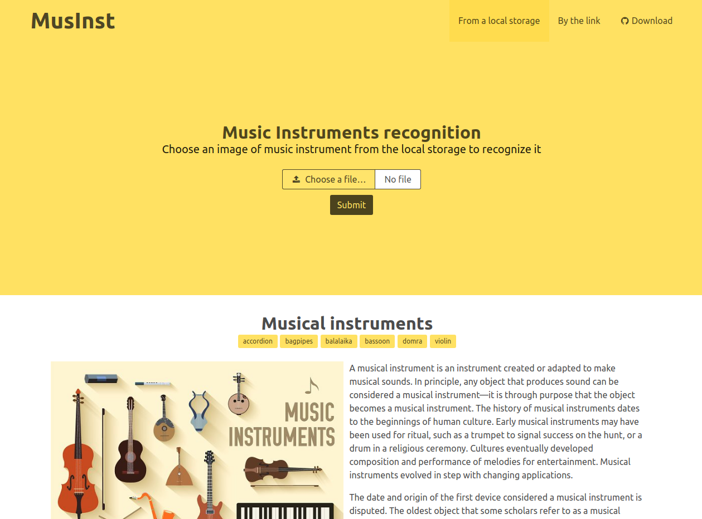
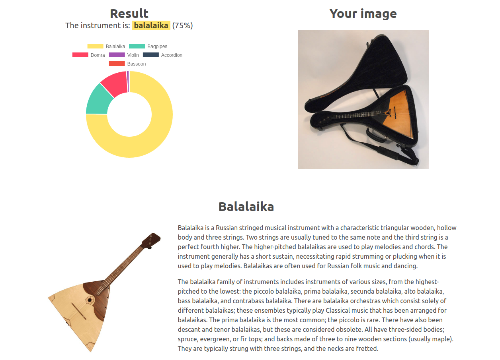
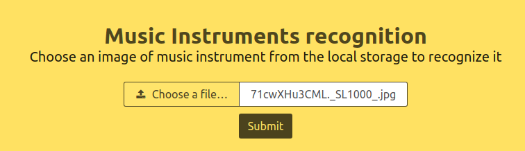
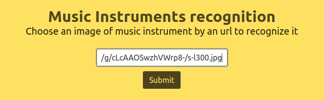
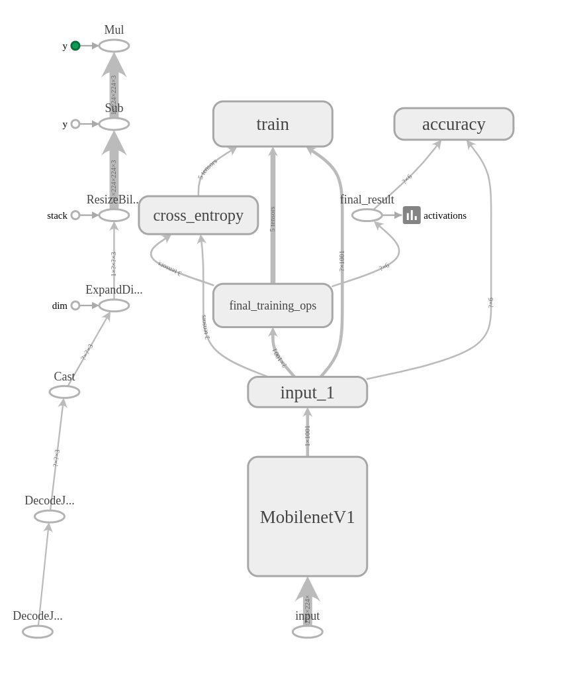

## Music Instruments recognition

### Description
It's a recognition tool, which will help you to find out -
what musical instrument is in front of you (by the picture).

### Available musical instruments for recognition
* accordion
* bagpipes
* balalaika
* bassoon
* domra
* violin

## How it looks like

### Main page

### Result page

### How to run
* Install python:
~~~bash
    make install_python_repo
    make install_python
~~~
* Create/update virtual environment with all 
necessary libraries by command:
~~~bash
    make venv_init
~~~
* Activate the virtual environment by command:
~~~bash
    source venv/bin/activate
~~~
* Run server by command:
~~~bash
    make runserver
~~~

* Go to http://127.0.0.1:8080

### How to recognize a musical instrument by a picture
* Download from a local storage
    

* Using url 
    

### Tensorflow graph (architecture: mobilenet_0.50_224)
